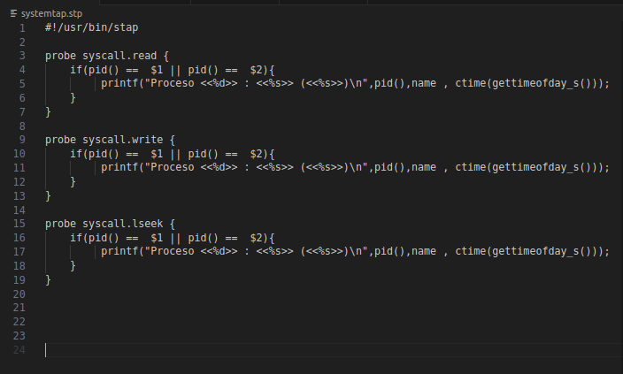
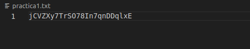
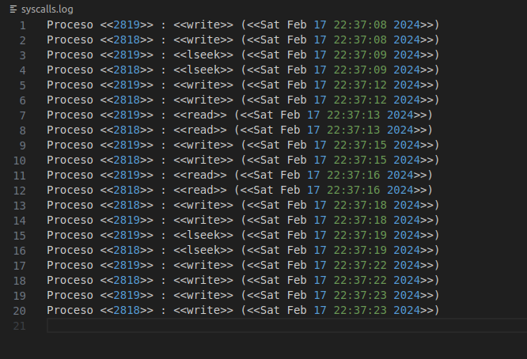
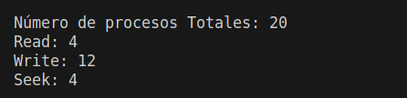

# MANUAL TÉCNICO


## Configuraciones realizadas

### llamadas a sistema para gestion de procesos usadas
* fork()
* exec()
* exit()
* wait()


### Señales Utilizadas
* SIGNIT

### llamadas a sistema para el manejo de archivo utilizadas.
* Open()
* Read()
* Write()
* Close()

### Explicacion del codigo
**parent.c** Este archivo de C se encarga de crear dos procesos hijos usando fork() , Tambien ejecuta un archivo de systemtap para el monito de las funciones write,read,seek que ejecuta los procesos hijos.

Para monitorio los proceso se hacen por medio systemtap que es una herramienta especial para esto aqui en el archivo ***systemtap.stp*** podemos ver la configuracion realizada.


**child.c** Este archivo de C es el que genera procesos para write,read,seek y los escribe un archivo ***practica1.txt***.


El proceso padre ejecuta systemtap para monitorios los proceso del hijo y los escribe en un archivo ***syscalls.log*** el cual contiene todos los procesos que genero el proceso hijo 



Al mandar una señal signit con control + C mostramos 4 contadores los cuales muestra el numero total de procesos que realizo el hijo y 3 que muestran cuantos fueron read,write,seek.



### ejecucion del codigo 
```
gcc child.c -o child.bin
gcc parent.c -o parent
./parent
```

### detener el codigo 
```
persionamos control + c
```


