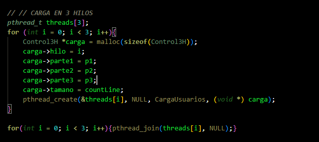
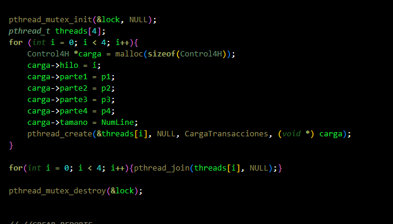
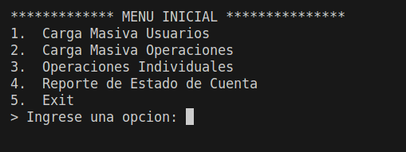
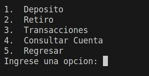

# MANUAL TÉCNICO


## Configuraciones realizadas

### Uso de mutex
#### Explicacion 
Los mutexes son buenos sólo para administrar la
exclusión mutua para cierto recurso compartido o pieza de
código, su implementacion es  con facilidad y eficiencia, lo cual hace que
sean especialmente útiles en paquetes de hilos que se
implementan en su totalidad en espacio de usuario.
### Carga de Usuarios en 3 Hilos


### Transacciones con 4 Hilos Concurrentemente



### Explicacion del codigo
**main.c**  este archivo de C es el encargado de generar un menu el cual despliega 5 opciones:

* opcion 1: Aqui realiza la carga de usuarios en 3 hilos.
* opcion 2: Aqui realiza las transacciones concurrentemente con 4 hilos.
* opcion 3: Nos lleva a un menu de operaciones.
* opcion 4: Genera un reporte del estado actual de la cuenta de los usuarios.
* opcion 5: Sale del programa.

**operaciones.c** Este archivo gener el submenu de operaciones la cual despliega 5 opciones:

* opcion 1: Ingresa una cuenta y procede a ingresar el monto a depositar.
* opcion 2: Ingresa una cuenta y procede a ingresar el monto a debitar.
* opcion 3: Aca ingresa 2 cuentas la primera es la cuenta de donde se va retirar el monto y la 2 es donde se va depositar el monto retirado.
* opcion 4: Puede consultar una cuenta en concreto y ver su informacion.
* opcion 5: Regresa al menu principal.


### ejecucion del codigo 
```
gcc main.c users.c operaciones.c -lpthread -o main
./main
```